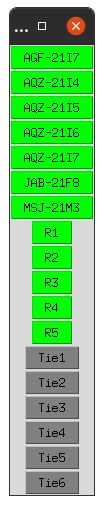

# Sistema Multiagente de Recomposição Automática

Desenvolvido com a biblioteca [PADE](https://github.com/grei-ufc/pade), o Sistema Multiagente de Recomposição Automática (SMRA) apresenta uma abordagem sob o paradigma de programação orientada a agentes para a automação de um sistema de distribuição de média tensão. PADE é um framework voltado à criação, execução e gerenciamento de agentes seguindo as especificações da FIPA (_Foundation for Intelligent Physical Agents_). 

O SMRA é concebido de forma a decompor o fluxo de recomposição de um sistema mediante uma falta em 3 categorias de agentes:

- Agente de Diagnóstico e Configuração (ADC);
- Agente de Comunicação (AC);
- Agente de Negociação (AN).

Internamente, os ADCs fazem uso da biblioteca [MyGrid](https://github.com/grei-ufc/MyGrid) para representação da porção da rede elétrica pela qual cada agente é responsável. Os ACs fazem a interface entre relés (IED) em campo e ADCs.

De forma a alavancar a interoperabilidade em Smart Grids, todos os objetos de informação trocados entre agentes são modelados com base no _Common Information Model_, descrito nas normas IEC 61970-301, IEC 61968-11 e IEC 62325-301.


## Estudo de Caso

O programa e os agentes estão configurados para a seguinte rede elétrica:


## Como iniciar programa

1. Instale todos os componentes necessários:
```bash
pip install -r requirements.txt
```

2. Inicialize o banco de dados que será utilizado para os agentes do PADE:
```bash
pade create-pade-db
```

3. Execute o exemplo `start.py` (o script já contém o código necessário para executar o AMS, logo NÃO é necessário executar `pade start-runtime`):
```bash
python examples/start.py
```

4. Aguarde até que os ADCs se inscrevam junto aos ACs. O seguinte log aparecerá no terminal quando isso acontecer:
```bash
[AgenteDiagnósticoConfiguração-1@localhost:60011] 10/11/2020 17:40:30.160 --> Inscrito em AgenteComunicação-1@localhost:60010
[AgenteDiagnósticoConfiguração-2@localhost:60021] 10/11/2020 17:40:30.221 --> Inscrito em AgenteComunicação-2@localhost:60020
[AgenteDiagnósticoConfiguração-3@localhost:60031] 10/11/2020 17:40:30.426 --> Inscrito em AgenteComunicação-3@localhost:60030
[AgenteDiagnósticoConfiguração-4@localhost:60041] 10/11/2020 17:40:30.525 --> Inscrito em AgenteComunicação-4@localhost:60040
```

5. Junto à janela que se abre (figura a seguir), simule a abertura de disjuntores. Disjuntores fechados (ativos) são mostrados em verde, enquanto aqueles abertos (inativos) são mostrados em cinza.
Verifique a reação do sistema à abertura do disjuntor.

